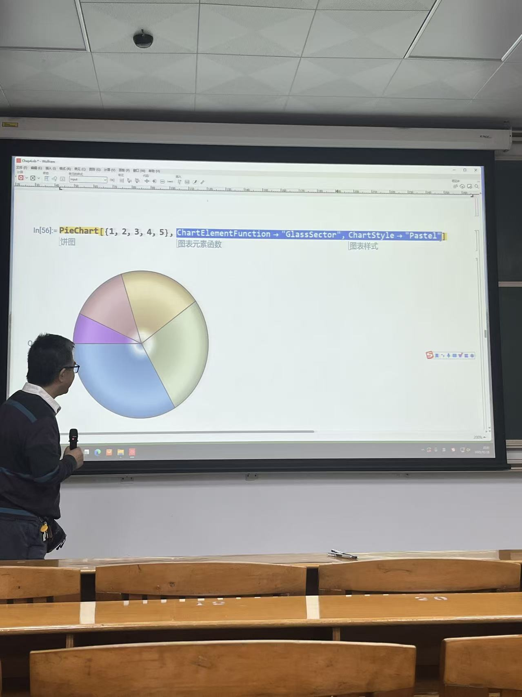
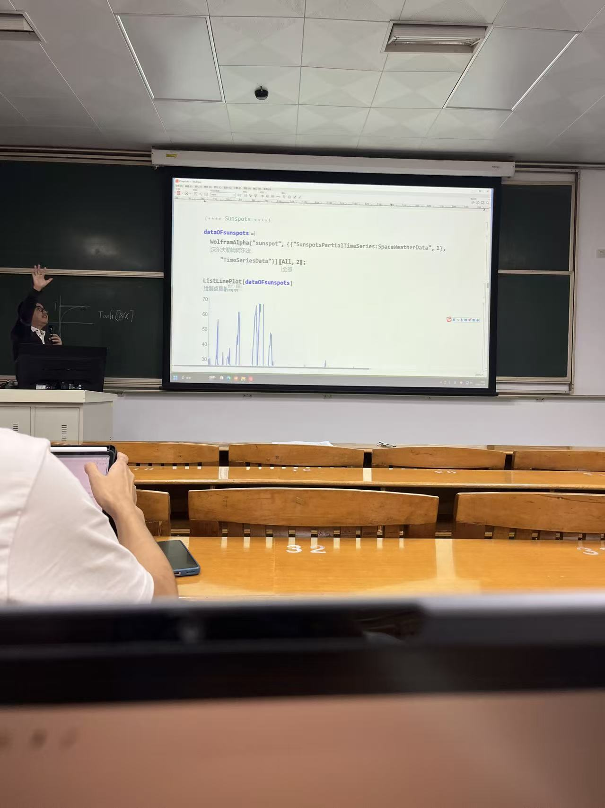
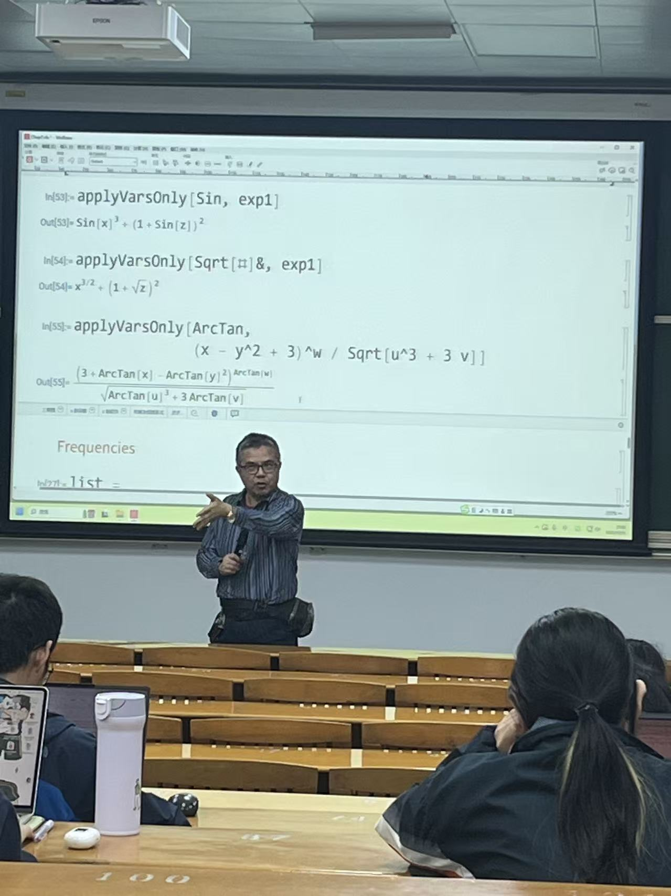

# 面向应用的 Mathematica/MATLAB

这门课整体偏硬核，但很实用。名字里有 Mathematica 和 MATLAB，不过老师实际主要讲的是 **Mathematica（MMA）**，MATLAB 部分基本不涉及。

!!! info "课程速览"
	- 课程强度：中等偏上（对理工科同学更友好）
	- 主要内容：Mathematica 实操与代码讲解
	- 考核方式：项目 + 报告
	- 适合人群：电信、计算机、材料、化学等理工科方向

## 课堂体验

老师上课会逐行分析代码，并现场演示运行结果，属于“边讲边跑”的实战型教学。

*邵老师的穿搭总给我一种“收租收腻了来讲两节课”的错觉（bushi）。*

从实用性看，这门课值得上。中文互联网里系统讲 Mathematica 的内容不算多，课堂上能少走不少弯路。

## 课程节奏与要求

- 老师会随机点人回答问题（有一点“看眼缘”）。
- 大约有 6 次课前签到，通常是排队打钩。
- 东校同学体感要求略高一些，可能和选课人群中理工科比例更高有关。

## 课堂照片

## 成绩与建议

我最后的成绩是 **B+（85-89）**，班级排名大约 **56/109**，属于中位数附近。

如果只是提升技能、拓宽工具栈，这门课性价比不错；如果你后续有留学规划且很在意成绩表现，建议结合自己的时间精力谨慎评估投入。